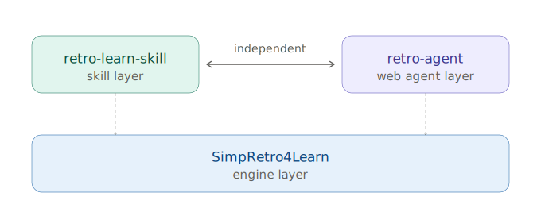
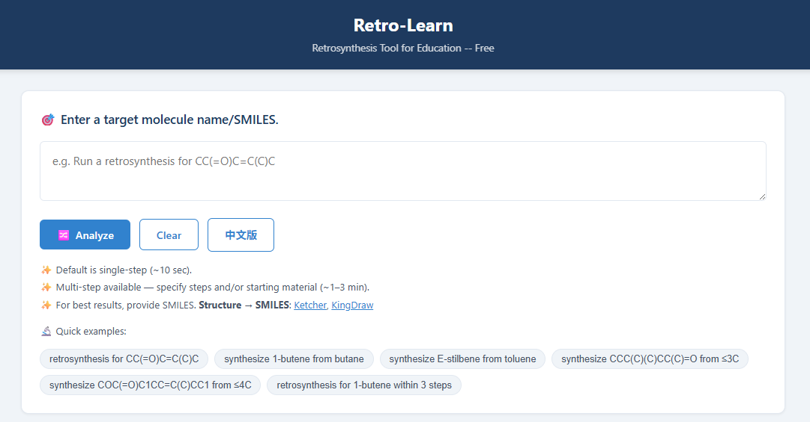

# RetroLearn

Retro-Learn provides compuper- and LLM- assisted retrosynthetic route planning tools.  
- `SimpRetro4Learn` provides template-based retrosynthesis engine, whose reaction templates are customized for university-level organic chemistry and educational use.
- `retro-learn-skill` contains an AI agent-compatible SKILL and helper scripts that enable an agent to call SimpRetro engine and perform retrosynthetic route planning and results visualization automatically. 
- `retro-agent` web agent layer that connects users with SimpRetro engine through a large language model. It interprets natural-language requests, invokes the underlying engine, and presents synthesis routes and explanations in a user-friendly format. A demo page page: http://49.232.19.102/ 
---

## Repository Structure


```text
Retro-Learn/
+-- README.md                       # This file
|
+-- SimpRetro4Learn/                # Standalone retrosynthesis engine
|   +-- README_SimpRetro4Learn.md
|   +-- main.py                     # Single-step engine 
|   +-- ......      
|
+-- retro-learn-skill/              # AI skill wrapper
|   +-- SKILL.md
|   +-- engine/                     # Engine adapter used by the skill
|   +-- scripts/
|
+-- retro-agent/                    # FastAPI + LLM web agent
    +-- retro-agent_README.md
    +-- ......    

```
### Three-component architecture:

| Repository | Purpose | Utility |
|------------|---------|---------|
| [SimpRetro4Learn](https://github.com/wzhstat/SimpRetro4Learn) | Retrosynthesis engine (pure algorithm, no LLM) | Can be used as a stand-alone package without AI |
| [retro-learn-skill](https://github.com/xiaolixl/retro-Learn-skill) | AI-agent skill layer + helper scripts  | Works with AI agent (e.g., Codex, Claude Code, WorkBuddy) to automate workflow |
| [retro-agent](https://github.com/xiaolixl/retro-agent) | Web agent layer (FastAPI + LLM + browser UI) | Requires API KEY, can be used as a web service |
---

## Quick Start

### 1. SimpRetro4Learn:

To use the tools in this packahge, you should install and test 
`SimpRetro4Learn` first. Follow the instructions in SimpRetro4Learn/README.md to setup up the required Python environment, after which the single-step retrosynthetic analysis can be performed by calling the following command. 

```bash
    cd SimpRetro4Learn
    python main.py -s "CC(=O)C=C(C)C" 
```
See SimpRetro4Learn/README.md for the more details about the attributes and advanced utility of the program, and also template-preprocessing instruction.


### 2. retro-learn-skill

`retro-learn-skill` enables AI agents such as Codex, Claude Code, and WorkBuddy to automate retrosynthesis analysis through natural-language conversation. The host AI assistant parses the user request and calls the local scripts, so this layer does not need its own external API key. This SKILL enables multi-step retrosynthesis search. 

How it works:

1. The user describes the target molecule and desired route in natural language (e.g. "Find a 3-step retrosynthesis route for CC(=O)C=C(C)C", or "Find a synthesis route for stillbene from tolune").
2. The AI agent parses the request — converting chemical names to SMILES, extracting the target SMILES, step count, and any preferred starting materials. 
3. The agent runs `retro-learn-skill/scripts/run_retro.py`, which calls the SimpRetro engine.
4. The agent runs `retro-learn-skill/scripts/visualize.py` to generate an HTML route view with RDKit molecular structures.


#### 2.1 Clone

```bash
git clone --recurse-submodules https://github.com/xiaolixl/retro-learn-skill.git
cd retro-learn
```

> If you already cloned without `--recurse-submodules`, run:
> ```bash
> git submodule update --init --recursive
> ```
The environment requirements for the scripts under the retro-learn-skill/ are the same as those for SimpRetro4Learn. So if you have setup up the environment for SimpRetro4Learn, you do not need to install any additional packages for SKILL.

#### 2.2 Install SKILL on AI Agent
- Claude Code：se retro-learn-skill/SKILL.md as the skill instruction file.
- WorkBuddy: upload the retro-learn-skill/ folder as a skill.
- Codex

#### 2.3 Automate Retrosynthetic Analysis with SKILL 
In the chatbox of the AI agent with the SKILL installed, type:
```text
"Find a 3-step retrosynthesis route for CC(=O)C=C(C)C" 

"Find a synthesis route for stillbene from tolune"
```
The agent will invokes the underlying retrosynthesis engine with the guideline written in SKILL.md. 


### 3. retro-agent: 

`retro-agent` is the agent application layer built on top of `SimpRetro4Learn`. It includes backend workflow scripts and an HTML frontend. It requires an OpenAI-compatible API key because it uses an external LLM to parse natural-language requests. The web UI provides user-friendly interface and result display. A demo page has been setup by the development team:  http://49.232.19.102/ (This demopage uses DeepSeek API)



#### 3.1 Install retro-agent
Download retro-agent folder to your work directory. If the environment required for SimpRetro4Learn has already been configured, retro-agent  requires  three additional Python packages:
```bash
pip install openai fastapi uvicorn
```
There is no need to reinstall all dependencies listed in retro-agent_README.md.

#### 3.2 API Key Configuration

Configure the API credentials in `retro-agent/agent_config.ps1`:

```bash
$env:OPENAI_API_KEY="your_api_key_here"
$env:OPENAI_BASE_URL="https://your-compatible-endpoint"
$env:OPENAI_MODEL="model_name"
```

#### 3.3 Start the Server
```bash
cd retro-agent
. .\agent_config.ps1  # Load API key environment variables
python -m uvicorn agent_api:app --host 127.0.0.1 --port 8000
```

Then open:

```text
http://127.0.0.1:8000
```

Example: In the webpage box enter:
```text
Perform retrosynthetic analysis for CC(=O)C=C(C)C
```

You can also use the CLI:

```bash
cd retro-agent
python agent_cli.py -q "RPerform retrosynthetic analysis for CC(=O)C=C(C)C"
```
---
